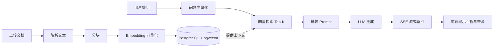

# 企业知识库问答系统：功能需求分析

## 1. 项目定位

做一个"可上传文档、可提问、回答带出处"的 RAG 知识库问答系统，作为面试 Demo 展示全链路技术能力。范围刻意收敛：不做复杂的权限、多租户、多知识库、任务队列，重点是把每条技术链路打通并能在面试中讲清楚。

### 核心展示点

- PostgreSQL：业务数据、会话数据持久化
- pgvector：向量数据与业务数据存在同一个 PostgreSQL，降低部署复杂度，同时体现"向量数据库"技术点
- RAG：文档解析、分块、向量化、检索、生成、引用溯源
- FastAPI：REST API、异步处理、SSE 流式输出
- Vue 3：文档管理页、问答页、会话历史
- 工程化：数据模型、迁移脚本、环境配置、接口文档、基础测试

## 2. 技术选型

| 层次 | 技术 | 用途 |
| --- | --- | --- |
| 前端 | Vue 3 + Vite + TypeScript | 应用框架与构建 |
| 前端 | Vue Router + Element Plus + Axios（页面状态放组件内，无全局 store） | 路由、UI、HTTP |
| 后端 | FastAPI + Pydantic v2 | API 与参数校验 |
| 后端 | SQLAlchemy 2 + Alembic | ORM 与数据库迁移 |
| 数据库 | PostgreSQL 16 + pgvector | 业务表 + 向量检索 |
| 向量模型 | OpenAI Embeddings，或本地 BGE-M3 | 文本向量化 |
| 大模型 | OpenAI 兼容接口，或 Ollama / 通义等本地模型 | 答案生成 |
| 文档解析 | pypdf / python-docx / markdown 解析 | 文档内容提取 |
| 接口协议 | REST + SSE | 普通接口 + 流式回答 |

### 关键设计决策

向量数据库推荐直接用 `pgvector`：

- 一个 PostgreSQL 同时存文档元数据、分块文本、向量、会话，demo 启动简单
- 面试时可以说明：pgvector 满足中小规模知识库；如果需要海量向量或更高召回性能，可替换为 Milvus / Qdrant，上层检索接口保持抽象

Embedding 与 LLM 统一封装为"可配置 Provider"：

- 演示环境如果无法联网，可切换本地模型
- 通过环境变量切换，不改业务代码

## 3. 用户角色

| 角色 | 说明 |
| --- | --- |
| 普通用户 | 上传文档、提问、查看会话，MVP 不做登录 |
| 管理员 | 可选扩展，不做入 MVP |

## 4. 功能需求

### F1 文档管理

#### F1.1 上传文档

用户选择本地文件上传，支持 `txt / md / pdf / docx`。

验收标准：

- 上传后前端显示文件名、大小、上传时间、处理状态
- 单文件大小限制为 10MB，超出时给出明确错误提示

#### F1.2 解析与分块

后端按文件类型解析文本，并按规则分块。

验收标准：

- 不同文件类型走不同解析器
- 默认 `chunk_size = 500` 字符、`overlap = 100` 字符，参数可配置
- 分块逻辑能保留段落语义，避免在句子中间硬切

#### F1.3 向量化与入库

每个分块生成向量，写入 `chunks.embedding`，并更新文档状态。

验收标准：

- 入库后文档状态变为 `ready`
- 可在 PostgreSQL 中查询到分块记录和向量
- 处理失败时文档状态为 `failed`，可手动重试

#### F1.4 文档列表与删除

展示已上传文档、分块数量、处理状态，支持删除。

验收标准：

- 删除文档时级联删除其分块和向量
- 删除后检索结果中不再出现该文档内容

### F2 RAG 问答

#### F2.1 提问与向量检索

用户输入问题，后端将问题向量化，在知识库中检索 Top-K 相关分块。

验收标准：

- 默认 `top_k = 4`，可配置
- 返回结果按相似度排序，并显示相似度分数

#### F2.2 生成回答并引用来源

把检索到的分块作为上下文，构造 Prompt 调用 LLM 生成回答。

验收标准：

- 回答展示引用来源，例如分块摘要、文档名、页码或片段
- 引用与检索结果对应，而不是编造来源

#### F2.3 流式输出

后端通过 SSE 逐段返回生成内容，前端实时渲染。

验收标准：

- 回答过程中页面实时显示文字，不等待完整结果
- 流中断时前端给出错误提示，而不是一直转圈

#### F2.4 无依据处理

当检索相似度低于阈值或没有相关内容时，给出明确提示。

验收标准：

- 默认相似度阈值为 `0.5`，可配置
- 低相似度时回答："当前知识库中没有找到足够依据"
- 不强行编造答案

#### F2.5 新建与清空会话

支持新建会话、清空当前对话。

### F3 会话管理

#### F3.1 会话列表

展示历史会话标题与最近更新时间。

#### F3.2 查看历史消息

点击会话后加载完整问答记录，包含问题和回答。

#### F3.3 删除会话

支持删除单个会话，并同步删除其消息。

### F4 参数配置（轻量）

以下参数通过后端环境变量或简单设置面板提供，不单独做管理后台：

- Embedding 模型与 LLM Provider
- `chunk_size`、`overlap`
- `top_k`、相似度阈值
- 单文件大小限制

### F5 可选扩展（不进入 MVP）

- JWT 用户登录
- 多知识库 / 文档分类
- 文档内容在线编辑
- 混合检索（BM25 + 向量）
- 重排模型 Rerank
- 后台任务队列 Celery / Redis

## 5. 非功能需求

| 类别 | 要求 |
| --- | --- |
| 性能 | 单用户演示场景下，文档入库分钟级完成，问答首字响应 3 秒内 |
| 稳定性 | 上传失败、解析失败、模型调用失败都要有错误提示，不能导致服务崩溃 |
| 可维护性 | 使用 Alembic 管理表结构，配置集中在环境变量 |
| 可观测性 | 后端打印入库、检索、模型调用关键日志 |
| 测试 | 至少覆盖分块逻辑、检索接口、问答接口的 happy path |
| 文档 | README 包含启动步骤、环境变量说明、演示脚本 |

## 6. 数据模型

### documents 文档表

| 字段 | 类型 | 说明 |
| --- | --- | --- |
| id | UUID | 主键 |
| filename | varchar | 原始文件名 |
| file_path | text | 存储路径 |
| file_size | int | 文件大小 |
| source_type | varchar | pdf / txt / md / docx |
| status | varchar | pending / processing / ready / failed |
| chunk_count | int | 分块数量 |
| error_message | text | 失败原因 |
| created_at | timestamp | 创建时间 |

### chunks 分块表

| 字段 | 类型 | 说明 |
| --- | --- | --- |
| id | UUID | 主键 |
| document_id | UUID | 外键，关联 documents |
| content | text | 分块文本 |
| chunk_index | int | 分块序号 |
| metadata | jsonb | 页码、标题等 |
| embedding | vector(1536) | 向量，维度跟随模型 |
| created_at | timestamp | 创建时间 |

### conversations 会话表

| 字段 | 类型 | 说明 |
| --- | --- | --- |
| id | UUID | 主键 |
| title | varchar | 会话标题 |
| created_at | timestamp | 创建时间 |
| updated_at | timestamp | 更新时间 |

### messages 消息表

| 字段 | 类型 | 说明 |
| --- | --- | --- |
| id | UUID | 主键 |
| conversation_id | UUID | 外键，关联 conversations |
| role | varchar | user / assistant |
| content | text | 消息内容 |
| sources | jsonb | 回答引用的来源列表 |
| created_at | timestamp | 创建时间 |

## 7. API 设计

| 方法 | 路径 | 说明 |
| --- | --- | --- |
| POST | `/api/documents/upload` | 上传文档并触发入库 |
| GET | `/api/documents` | 文档列表 |
| GET | `/api/documents/{id}` | 文档详情与分块预览 |
| DELETE | `/api/documents/{id}` | 删除文档 |
| POST | `/api/documents/{id}/retry` | 失败重试 |
| POST | `/api/chat` | 发起问答，SSE 流式返回 |
| GET | `/api/conversations` | 会话列表 |
| POST | `/api/conversations` | 新建会话 |
| GET | `/api/conversations/{id}/messages` | 会话消息 |
| DELETE | `/api/conversations/{id}` | 删除会话 |
| GET | `/api/health` | 健康检查 |

## 8. RAG 主流程

### 入库流程

1. 上传文件到临时目录
2. 按类型解析为纯文本
3. 按 `chunk_size` / `overlap` 分块
4. 调用 Embedding 接口为每块生成向量
5. 写入 `chunks` 表，更新文档状态为 `ready`

### 问答流程

1. 保存用户问题到 `messages`
2. 问题向量化，在 `chunks.embedding` 上做余弦相似度检索
3. 过滤低于阈值的分块，取 Top-K
4. 将分块内容、用户问题组装成 Prompt
5. LLM 流式生成，通过 SSE 返回前端
6. 回答完成后保存消息与来源列表

## 9. 前端页面设计

### 文档管理页

- 顶部：上传按钮、刷新按钮
- 主体：文档表格，列包括文件名、类型、大小、状态、分块数、上传时间、操作
- 操作：查看分块、删除、失败重试

### 问答页

- 左侧：会话列表，可新建、切换、删除
- 右侧：消息流，用户问题与助手回答交替展示
- 回答下方：来源卡片，显示文档名与片段
- 底部：输入框 + 发送按钮，支持 Enter 发送
- 回答过程中输入框禁用，展示"正在生成"状态

## 10. Demo 验收清单

1. 启动 PostgreSQL、后端、前端
2. 上传一份 PDF 和一份 Markdown，状态变为 `ready`
3. 在数据库中确认 `documents`、`chunks` 和向量已写入
4. 提问文档内的问题，得到带来源的流式回答
5. 提问无关内容，得到"没有足够依据"的提示
6. 新建、切换、删除会话，刷新页面后历史仍存在
7. 删除一个文档后，再提问相关内容，答案中不再引用它
8. 停止并重启服务，数据仍存在，证明 PostgreSQL 持久化
9. 打开 `/docs`，FastAPI 自动生成的接口文档可正常访问

## 11. 面试讲解点

1. 为什么选 pgvector：一个库同时解决业务数据和向量数据，适合中小规模；说明如何平滑迁移到独立向量库
2. 分块策略：为什么设置 `chunk_size` 和 `overlap`，如何避免语义断裂
3. Embedding 与 LLM Provider 抽象：如何支持本地模型和在线模型切换
4. RAG 与微调的区别：知识更新快、无需重新训练，以及各自的适用场景
5. 引用溯源：如何让模型只依据检索结果回答，降低幻觉
6. SSE 流式输出：相比一次性返回的用户体验优势与实现方式
7. 异步与失败处理：入库任务的状态机、失败重试
8. 数据一致性：删除文档时级联删除向量，保证检索结果干净

## 12. 建议开发顺序

1. 后端骨架：FastAPI + 数据库连接 + Alembic + `/api/health`
2. 文档上传与入库：解析、分块、Embedding、写 pgvector
3. RAG 问答接口：检索、Prompt、SSE 输出
4. 前端骨架：Vue 3 + 路由 + 状态管理 + 布局
5. 前端文档管理页
6. 前端问答页与会话管理
7. 联调、错误处理、README、演示脚本

## 13. 风险与注意事项

- 在线 Embedding / LLM 依赖网络和费用，Demo 前要确认网络可用，或准备本地模型
- PDF 解析质量取决于扫描件还是文本型 PDF，演示素材优先选文本型
- 大文件入库不要阻塞请求，入库放后台任务或线程池
- SSE 流中断要能结束前端 loading 状态
- 删除文档要同时清理向量，避免脏数据
- 不要把 API Key 写进前端代码
